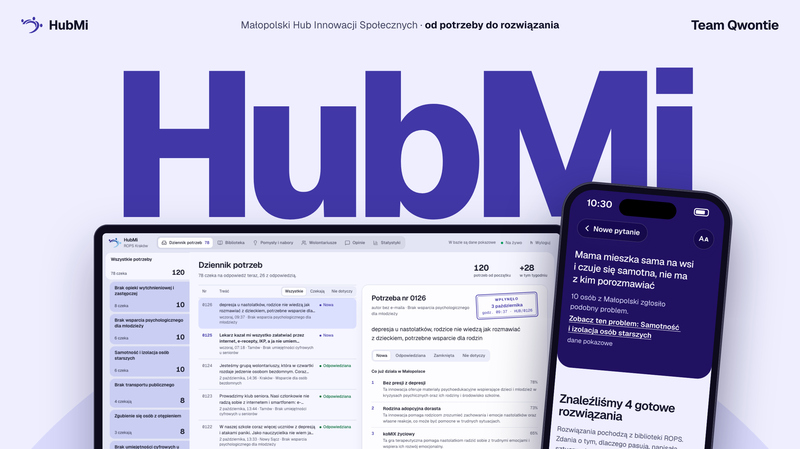

# HubMi



   

Platforma Małopolskiego Hubu Innowacji Społecznych (ROPS w Krakowie). Mieszkaniec, organizacja albo gmina opisuje problem własnymi słowami, a HubMi pokazuje pasujące innowacje społeczne z Biblioteki ROPS i jednym zdaniem tłumaczy, dlaczego pasują. Zgłoszenie trafia do panelu ROPS, gdzie pracownicy widzą, z czym ludzie przychodzą, grupują podobne sprawy i odpowiadają e-mailem.

**Wdrożenie produkcyjne: [DEPLOYMENT.md](DEPLOYMENT.md).** Opisuje krok po kroku drogę od obecnej wersji demonstracyjnej do prawdziwej produkcji na serwerze ROPS lub Województwa.

## Wersja demonstracyjna

https://hubmi.qwontie.dev (panel ROPS: `/admin`) to wersja pokazowa z hackathonu HackYeah 2026. Działa na serwerze zespołu, a zgłoszenia, pomysły i wolontariusze w niej to dane przykładowe (adresy wyłącznie w domenie example.org). Nie wpisuj tam prawdziwych danych osobowych. Biblioteka innowacji, wyzwania i materiały pochodzą z publicznych stron rops.krakow.pl.

## Moduły

| Moduł | Co robi |
|---|---|
| Matchmaking | wyszukiwanie po znaczeniu i po słowach, uzasadnienie każdego wyniku |
| Zasobnik wiedzy | biblioteka innowacji, wyzwania regionu, materiały ROPS, mapa powiatów |
| Kreator pomysłów | fiszka i kanwa pomysłu z asystentem, wniosek do naboru z eksportem do PDF |
| Tester innowacji | ocena „pasuje / nie pasuje”, zgłoszenia wolontariuszy do testów |
| Komunikacja | rozmowa ROPS z autorem przez link w e-mailu, opinie ekspertów, powiadomienia o naborach |
| Panel ROPS | dziennik potrzeb, grupy podobnych spraw, biblioteka, pomysły, wolontariusze, statystyki |
| Middleman | plan wdrożenia innowacji dla konkretnej gminy lub instytucji |

## Stos

| Część | Katalog | Technologia |
|---|---|---|
| API | `backend/` | Python 3.13, FastAPI, SQLModel, Alembic, Google Gemini |
| Baza | | PostgreSQL 17 z pgvector |
| Panel ROPS | `frontend/` | SvelteKit 2, Svelte 5 |
| Aplikacja dla mieszkańców | `mobile/` | React Native z Expo, eksport na web serwowany pod `/` |
| Proxy | `caddy/` | Caddy z HTTPS |

Wszystko działa w kontenerach Docker Compose.

## Uruchomienie lokalne

Potrzebne: Docker z Compose, `make`, `openssl`. Do pracy nad kodem także `uv` i `bun`.

```sh
docker network create caddy
make env
```

`make env` tworzy `.env` z plików `.env.example` oraz pliki `*/docker-compose.override.yml` z losowymi portami na 127.0.0.1. W `.env` ustaw:

- `AUTH__SECRET` i `DB__PASSWORD`, na przykład wartościami z `openssl rand -hex 32` (API nie wystartuje z domyślnymi);
- `MAILER__PUBLIC_URL=http://hubmi.localhost` (API przyjmuje logowanie i formularze tylko z tego adresu);
- `LLM__GEMINI_API_KEY`, jeśli mają działać funkcje AI.

```sh
make deploy
make -C backend script user.create -- admin '<hasło>' --role admin
```

`make deploy` buduje obrazy, uruchamia bazę, migracje i usługi. Treści z ROPS (wymaga klucza Gemini, pierwszy import wiedzy trwa ok. 30 minut):

```sh
make -C backend script library.import_rops
make -C backend script knowledge.import_rops
```

Proxy z adresem http://hubmi.localhost:

```sh
cd caddy && cp Caddyfile.example Caddyfile && cp .env.example .env && docker compose up -d
```

Aplikacja: http://hubmi.localhost, panel ROPS: http://hubmi.localhost/admin (logowanie kontem z `user.create`). Kolejne konta pracowników tworzy się tym samym poleceniem.

Dla deweloperów: `make fmt` formatuje, `make check` uruchamia ruff, ty, linter i sprawdzanie typów we wszystkich częściach.

## Ujawnienie

Kod napisali agenci AI prowadzeni przez czteroosobowy zespół Qwontie, który projektował rozwiązanie, sprawdzał je i odpowiada za wynik. Dane pochodzą wyłącznie z publicznych stron ROPS w Krakowie.
